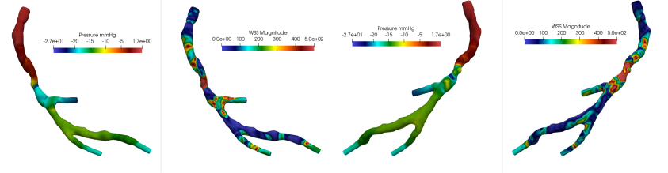

# TEPEM for Education - TEPEM4Ed

TEPEM4Ed (TEPEM for Education) é um software de simulação do escoamento sanguíneo 3d, desenvolvido para a primeira edição do minicurso "Introdução à Hemodinâmica Computacional" (2023) que encapsula dentro de um container Docker o método numérico denominado TEPEM (Transversally Enriched Pipe Element Method). 
O TEPEM foi desenvolvido durante a tese de doutorado do Alonso Alvarez, sob orientação do Pablo Blanco, no LNCC.

- Pablo Blanco. Pesquisador Títular do LNCC. pjblanco [at] lncc.br
- Alonso Alvarez. Pesquisador Adjunto do LNCc. lalvarez [at] lncc.br

Links de interesse:
- Laboratório Nacional de Computação Científica: [LNCC](https://lncc.br)
- Programa de Verão do LNCC: [PV-LNCC](https://verao.lncc.br)
- Hemodynamics Modeling Laboratory: [HeMoLab](http://hemolab.lncc.br)

Para clonar este repositório:
   ```bash
   git clone https://github.com/alonso-alvarez/PVLNCC_IntroHemodinamicaComputacional
  ```

## Requisitos


**Docker**: Docker é um aplicativo que simplifica o processo de gerenciamento de processos de aplicativos em contêineres. Os contêineres permitem que você execute seus aplicativos em processos isolados de recursos. Eles são semelhantes a máquinas virtuais, mas os contêineres são mais portáteis, mais amigáveis ​​aos recursos e mais dependentes do sistema operacional do host.
O TEPEM4Ed contem, entre outras, as seguintes características:
- O sistema operacional escolhido é Ubuntu 18.04
- Para a comunicação paralela: OpenMPI
- O toolkit para computação cientifica PETSc 3.6
- O código TEPEM, para a solução de problemas em hemodinâmica, desenvolvido no grupo HeMoLab.

- Instalação: Recomendamos o seguinte tutorial [Instalar Docker](https://www.digitalocean.com/community/tutorials/how-to-install-and-use-docker-on-ubuntu-20-04)
- Buscar e utilizar a imagem:
   ```bash
   docker search hemolab
   docker run -it hemolab/tepem4ed
  ```

**Visualização.** Para a visualização dos resultados, utilizaremos o conhecido software [Paraview](https://www.paraview.org/download/)

## Conteúdo do container

**Executáveis**: Dois executáveis são disponibilizados dentro da imagem docker:
- tepem: Para a solução do problema de Navier-Stokes utilizando o método TEPEM
- postprocessing: Para a geração do arquivo para post-processamento, a ser visualizado dentro do Paraview.
  
**Exemplos**: Em nível de complexidade
- Exemplo 1: Poiseuille flow
- Exemplo 2: Escoamento dentro de uma região curvada
- Exemplo 3: Segmento simulando uma estenose
- Exemplo 4: Segmento de artéria coronária obtida por exame IVUS
- Exemplo 5: Árvore coronariana direita
- Exemplo 6: Árvore coronariana esquerda

**Para cada exemplo**
- Basparam.txt: Arquivo contendo a configuração do problema: Navier-Stokes, estacionário, critério de parada, etc.
- Mesh.txt: Malha utilizada na discretização do domínio do problema, utilizando elementos tipo pipe.
- IniFile.txt: Condição incial para campos velocidade e pressão. Condição inicial nula
- Param.txt: Caracterísiticas materiais do problema.

## Exemplo 1: Escoamento de Poiseuille
O escoamento de Poiseuille é um flixo induzido por um gradiente de pressão em um duto cilíndrico circular reto.
Duas opções de queda de pressão são fornecidas: 1 mmHg e 10 mmHg
O problema é estacionário porém um esquema iterativo é empregado para tratar o termo não-linear das equações.
   ```bash
   cd examples/ex1_PoiseuilleFlow/
   cp ../../tepem .
   mpirun -np 1 --allow-run-as-root ./tepem > logout.log
  ```

Copiar os resultados para o domínio local
   ```bash
   docker cp <containerID>:<docker_path> <local_path>
  ```

Resultados com 1 mmHg
- DoFs: 26K
- Time with mpi = 1: 43 sec


## Exemplo 2: Bended pipe

Estudamos o escoamento dentro de um dominio curvado, rígido e com condições de contorno impondo um perfil parabólico na entrada (interface esquerda) e pressão nula na saida.

Três são os casos disponíveis, para diferente número de Reynolds: 250 (low), 500 (mid), 750 (high).

As variações transversais do campo de pressão são claramente idenfiticadas nesse exemplo.

- DoFs: 53K
- Time with mpi = 1 - Low Flow: 205 sec
- Time with mpi = 1 - Mid Flow: 264 sec
- Time with mpi = 1 - High Flow: 240 sec


## Exemplo 3: Stenosed pipe

Consideramos uma descrição sintética de uma estenose, redução do lúmen arterial, equivalente a 50% do diâmetro original.
A redução abrupta da área pela qual escoa o fluido resulta em altas velocidades e zonas de recirculação após a estenose.

As condições de contorno nesse caso são um perfil parabólico na entrada (seção esquerda) e pressão nula na saída.

- DoFs: 46K
- Time with mpi = 2: 73 sec
- Time with mpi = 4: 67 sec


## Exemplo 4: Coronary artery segment

Usando a segmentação de uma artéria via ultrasom intra-vascular, a geometria vascular é reconstruida sem a curvatura natural

Mostramos três casos correspondentes a diferente número de Reynolds: 250 (esquerda), 500 (centro) e 750 (direita)

As condições de contorno são vazão na entrada, imposta via método de multiplicador de Lagrange, e pressão nula na saída.

- DoFs: 240K
- Time with mpi = 1: 1188 sec


## Exemplo 5: Coronary tree

Uma árvore coronária, árvore direita, é considerada nesse caso.

Como condições de contorno distribuimos a vazão total pelas saídas, cada uma associada a um multiplicador de Lagrange, e consideramos pressão nula na entrada.

Os resultados de pressão e wall shear stress (WSS) são apresentados em duas vistas

- DoFs: 298K


